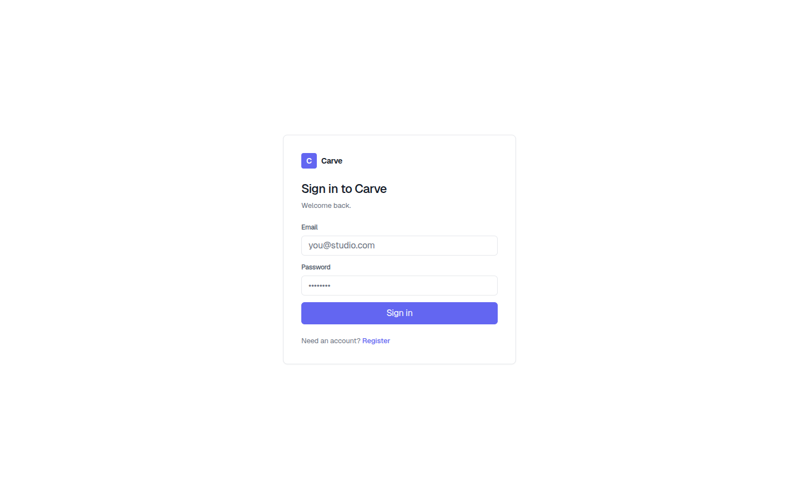
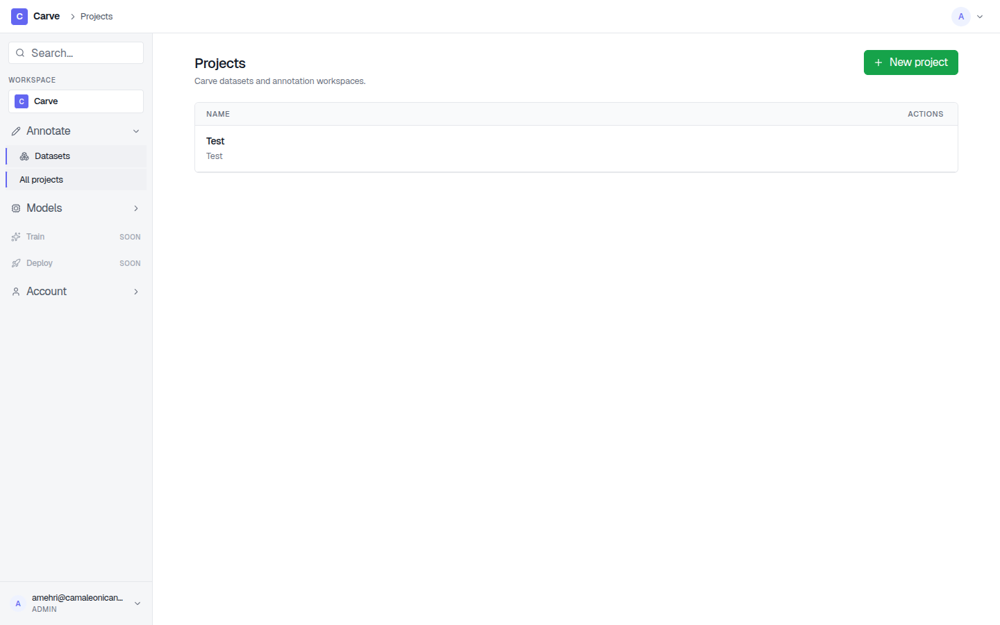
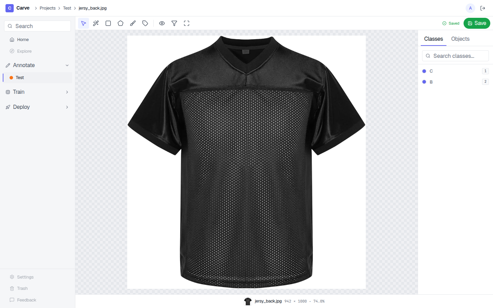
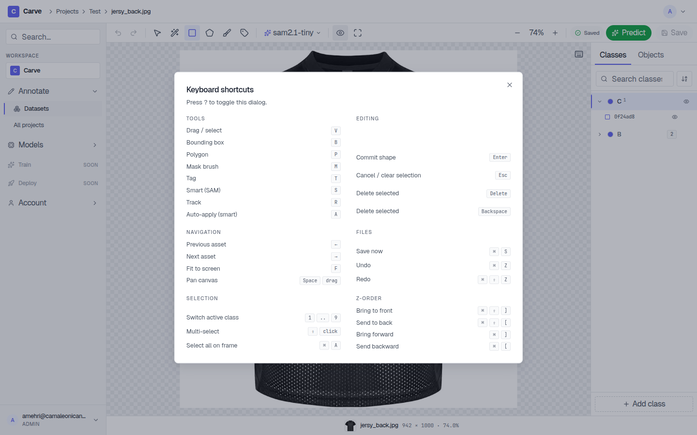
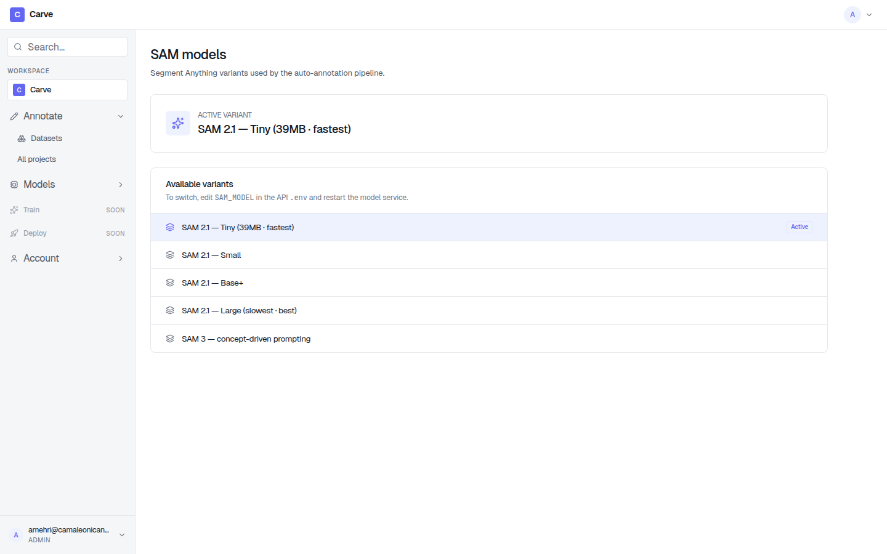
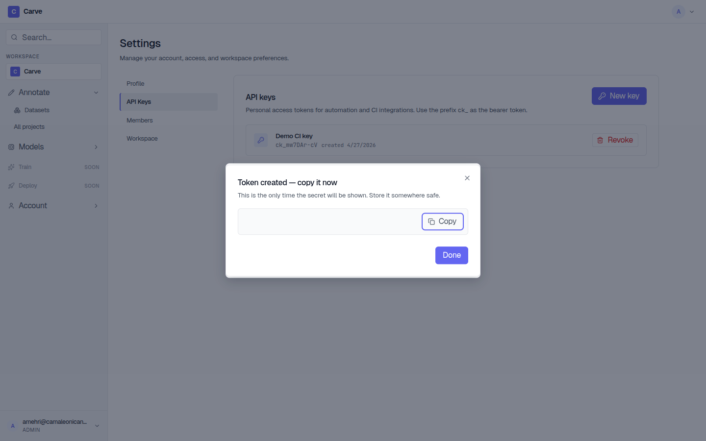

# Carve

**On-premises, web-based annotation editor for computer-vision datasets.**

Carve is a self-hosted, multi-user annotation platform supporting detection, segmentation, and classification — with SAM 2.1 / SAM 3 smart annotation, YOLO auto-annotate, and video object tracking. Built for teams who need full data control and GPU inference on their own hardware.

[](LICENSE)
[](https://github.com/sponsors/Rm1n90)
[](https://github.com/Rm1n90/Carve/releases)

> **Author**: [Armin Mehri](mailto:mehri.armin@gmail.com) · [github.com/Rm1n90](https://github.com/Rm1n90)

---

## Screenshots

| | |
|---|---|
|  |  |
| _Sign in_ | _Projects dashboard_ |
|  |  |
| _Three-column annotation editor_ | _Keyboard cheat sheet (`?`)_ |
|  |  |
| _SAM model selector_ | _API key management_ |

---

## Features

### Annotation tools
- **Bounding boxes**, **polygons**, **binary masks**, **brush**, and **classification tags** — all manual tools work without a GPU
- **SAM 2.1 smart annotation** — click positive/negative points; browser-side WebGPU decoder for sub-30 ms response
- **SAM 3 text prompts** — type "person" or "yellow truck" to segment by concept
- **YOLO auto-annotate** — run any YOLO11 / YOLO26 detection or segmentation weight over an entire task in one click
- **Video object tracking** — SAM 2 point-based propagation or SAM 3 concept-based tracking across frames

### Workflow
- **Multi-user auth** with role-based access (admin / annotator) and per-project scoping
- **API key authentication** (`Bearer ck_<token>`) for headless and CI pipelines; Argon2-hashed at rest
- **YOLO + COCO export** with per-class remap and train / val / test split
- **YOLO + COCO import** to load existing annotations
- **Soft-delete + Trash** with restore; admins can permanent-delete
- **Per-task and per-project analytics** — asset counts, annotation throughput, class distribution

### Infrastructure
- **Fully Docker Compose** — single `docker compose up -d --build` to start everything
- **TLS via Caddy** + Let's Encrypt auto-certificates
- **MinIO** S3-compatible object storage with scripted Postgres + MinIO backup
- **Lazy model loading** — SAM and YOLO never claim VRAM until used; LRU eviction keeps memory bounded
- **VitePress operator docs** mounted at `/docs`

---

## Quick Start

```bash
git clone https://github.com/Rm1n90/Carve.git
cd Carve
cp .env.example .env
# Edit .env: set POSTGRES_PASSWORD, MINIO_ROOT_PASSWORD, JWT_SECRET, CARVE_DOMAIN
docker compose up -d --build
```

Visit `https://<CARVE_DOMAIN>` — on a fresh database the **First-run admin wizard** appears to create the bootstrap admin account.

**GPU inference is optional.** Manual annotation, import/export, and analytics run on CPU only. An NVIDIA GPU + [NVIDIA Container Toolkit](https://docs.nvidia.com/datacenter/cloud-native/container-toolkit/latest/install-guide.html) is required only for SAM and YOLO inference.

Full setup guide → [Wiki: Getting Started](https://github.com/Rm1n90/Carve/wiki/Getting-Started)

---

## System Requirements

| Requirement | Details |
|---|---|
| OS | Linux x86\_64 (Ubuntu 22.04+); macOS for dev only |
| Docker | 26+, Compose v2 |
| GPU (inference only) | NVIDIA + CUDA 12.6 + NVIDIA Container Toolkit |
| VRAM — SAM 2.1 large | ~9 GB |
| VRAM — SAM 3 | ~12 GB |
| Disk | ~12 GB image cache + asset volume |

SAM sizes: `tiny` ~3 GB · `small` ~4 GB · `base-plus` ~6 GB · `large` ~9 GB · `sam3` ~12 GB. YOLO weights load on demand (LRU capacity 2), independent of SAM.

---

## Documentation

Full documentation lives in the [Wiki](https://github.com/Rm1n90/Carve/wiki):

| Topic | Link |
|---|---|
| Getting started | [Wiki: Getting Started](https://github.com/Rm1n90/Carve/wiki/Getting-Started) |
| Environment variables | [Wiki: Environment Variables](https://github.com/Rm1n90/Carve/wiki/Environment-Variables) |
| SAM model selection | [Wiki: SAM Models](https://github.com/Rm1n90/Carve/wiki/SAM-Models) |
| YOLO auto-annotate | [Wiki: YOLO](https://github.com/Rm1n90/Carve/wiki/YOLO) |
| Export formats | [Wiki: Export](https://github.com/Rm1n90/Carve/wiki/Export) |
| Backups & restore | [Wiki: Backups](https://github.com/Rm1n90/Carve/wiki/Backups) |
| Troubleshooting | [Wiki: Troubleshooting](https://github.com/Rm1n90/Carve/wiki/Troubleshooting) |
| Admin & operations | [Wiki: Admin](https://github.com/Rm1n90/Carve/wiki/Admin) |
| Local development | [Wiki: Local Development](https://github.com/Rm1n90/Carve/wiki/Local-Development) |

Operator docs also ship as a live VitePress site at `https://<CARVE_DOMAIN>/docs`.

---

## Contributing

Contributions are welcome. Please open an issue before starting significant work so we can align on direction.

### How to contribute

1. **Open an issue first** for bugs, feature requests, or design discussions.
2. **Fork the repo** and create a branch from `master`:
   ```bash
   git checkout -b feat/my-feature
   ```
3. **Follow the code style** — Ruff + Black for Python, ESLint + Prettier for TypeScript.
4. **Write tests** — PRs without tests for new behaviour will not be merged.
5. **Use conventional commits**:
   ```
   feat: add polygon simplification tool
   fix: correct SAM decode on high-DPI screens
   ```
6. **Open a pull request** against `master` with a clear description of what changed and why.

### Branch conventions

| Prefix | Purpose |
|---|---|
| `feat/` | New features |
| `fix/` | Bug fixes |
| `refactor/` | Refactoring without behaviour change |
| `docs/` | Documentation only |
| `chore/` | Build, CI, dependency updates |

### Code of Conduct

Be respectful. Constructive, on-topic feedback only. Hostile or off-topic issues and PRs will be closed.

---

## Sponsorship

Carve is free and open-source under AGPL-3.0. If it saves you time or infrastructure cost, please consider sponsoring development:

[](https://github.com/sponsors/Rm1n90)

Sponsorship helps fund new model integrations, performance improvements, and long-term maintenance.

---

## Release History

| Version | Highlights |
|---|---|
| v2.0.0 | Ultralytics-style 3-column editor · Settings family · Trash · API key auth |
| v1.4.0 | Multi-object video tracking with per-object propagation |
| v1.3.0 | SAM 3 click-prompt routing fix (Sam3TrackerModel + Sam3TrackerVideoModel) |
| v1.1.0 | SAM model selector · bf16 · torch.compile · idle eviction · SAM 3 |
| v1.0.0 | TLS · first-run wizard · rate limits · production polish |
| v0.5.0 | YOLO + SAM 2 inference · video tracking |
| v0.1–v0.4 | Foundation · projects · assets · annotation canvas |

Full changelog → [GitHub Releases](https://github.com/Rm1n90/Carve/releases)

---

## License

[AGPL-3.0](LICENSE) © 2024–2026 [Armin Mehri](mailto:mehri.armin@gmail.com)
